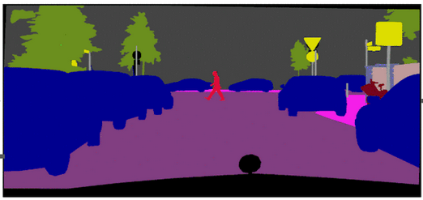

  

<h1 align="center">Semantic Segmentation   Literature Review & Implementation</h1>

A personal study repo tracking the evolution of semantic segmentation.  
Not optimized for SOTA accuracy — built for understanding how the field progressed.

## Goal
Read the foundational and milestone papers, implement their architectures, and document what each contribution changed and why it mattered.

## Not the Goal
- Chasing high mIoU or SOTA numbers
- Production-ready code
- Hyperparameter tuning

## Papers & Architectures
| Paper | Year | Key Contribution | Resources | Status |
|---|---|---|---|---|
|**Deep Learning Era** |||||
| U-Net | 2015 | Skip connections + encoder-decoder | [modeling/unet/](modeling/unet/) | DONE |
| DeepLab (4 papers) | 2017 | Atrous + multi-rate atrous| [modeling/atrous/](modeling/atrous/) | DONE | 
|**Transformer based Backbones Era** |||||
| SETR | 2021 | Transformer in semantc segmentation | [modeling/setr/](modeling/setr/) | DONE | 
| SegFormer | 2021 | Hierarchical transformer | [modeling/segformer/](modeling/segformer/) | DONE |
| SwinTransformer | - | - | - | - |
| SAM | - | - | - | - |
