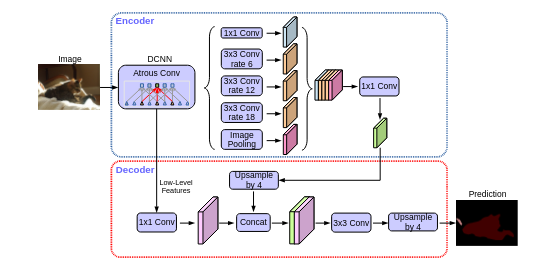

  

<h1 align="center"> DeepLab (Atrous) </h1> 

> [DeepLab V1: Semantic Image Segmentation with Deep Convolutional Nets and Fully Connected CRFs — Chen et al., 2015](https://arxiv.org/pdf/1412.7062)

> [DeepLab V2: Semantic Image Segmentation with Deep Convolutional Nets, Atrous Convolution, and Fully Connected CRFs — Chen et al., 2017](https://arxiv.org/pdf/1606.00915)

> [DeepLab V3: Rethinking Atrous Convolution for Semantic Image Segmentation — Chen et al., 2017](https://arxiv.org/pdf/1606.00915)

> [DeepLab V3+: Encoder-Decoder with Atrous Separable Convolution for Semantic Image Segmentation — Chen et al., 2018](https://arxiv.org/pdf/1802.02611)

