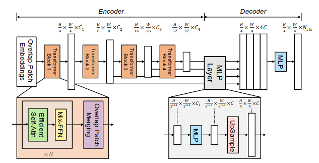
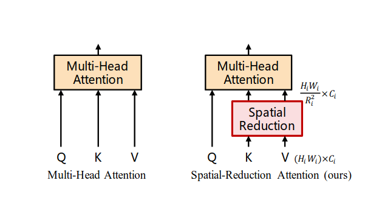

  

<h1 align="center"> SegFormer </h1> 

> SegFormer: [SegFormer: Simple and Efficient Design for Semantic Segmentation with Transformers — Xie et al., 2021](https://arxiv.org/pdf/2105.15203)

# Architecture

## Hierarchical Transformer Encoder (MiT)

### Overlap Patching Embedding
Unlike SETR, SegFormer uses overlapping patches
which let adjacent patches attend to each others.

### Effcient Self-Attention "SRA"

  

the core component in this module is the **Spatial Reduction Attention (SRA)**, first introduced in [Pyramid Vision Transformer: A Versatile Backbone for Dense Prediction without Convolutions - wang et al., 2021](https://arxiv.org/pdf/2102.12122). due to the high computational complexity of standard self-attention, SRA reduces the length of the **Key (K)** and **Value (V)** tensors by a factor of \( r \).

K.shape = [N/r, C]

V.shape = [N/r, C]   

Q.shape = [N, C]

ignoring scaling factors, attention is computed as:

attention(Q, K, V) = (Q@K.T)@V  

scores = Q@K.T = [N, C] X [C, N/r] = [N, N/r] 

then scores@V = [N, N/r] X [N/r, C] = [N, c]

### Mix-FNN
Positional encoding is an important component of standard transformer, the classical transformer in **attention is all you need paper** is encoding 1d sequential words but the image structure is different than text, This has led to a research direction focused on designing effective ways to encode positional information for image patches. anyway the SegFormer removed explicit postional encoding and instead introduces **Mix-FFN**, arguing that no need for explicit encoding because conv operation already provides sufficient spatial inductive bias. 

The Mix-FFN is defined as:

$$
x_{\text{out}} = \mathrm{MLP}\big(\mathrm{GELU}(\mathrm{Conv}_{3\times3}(\mathrm{MLP}(x_{\text{in}})))\big) + x_{\text{in}}
$$

## Decoder
there is no art in the decoder it is lightweight MLP based head.

- it takes multi-scale features from the encoder
- Projects each feature map to a unified embedding dimension
- Upsamples all features to the same spatial resolution
- Concatenates them
- Applies a final linear projection to produce segmentation logits
