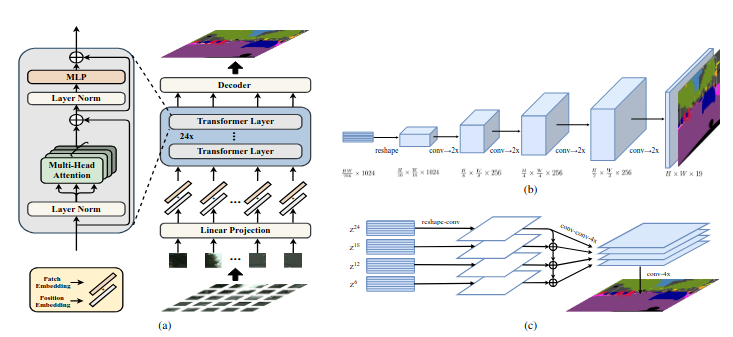

  

<h1 align="center"> SETR </h1>

> SETR: [Rethinking Semantic Segmentation from a Sequence-to-Sequence Perspective with Transformers — Zheng et al., CVPR 2021](https://openaccess.thecvf.com/content/CVPR2021/papers/Zheng_Rethinking_Semantic_Segmentation_From_a_Sequence-to-Sequence_Perspective_With_Transformers_CVPR_2021_paper.pdf)

# Background
After transformer seen as a game changer in the field many researchers attemped to borrow it from NLP area to different doamins like computer vision, this paper is one of them. the computer vision area and semantic segmentation problem was dominated with fully convoulational networks (FCN), the first attemps worked on replacing CNNs with transformer.
it is striking how first attemps used Transformer architecture as a black box (it will be illustared more later)

