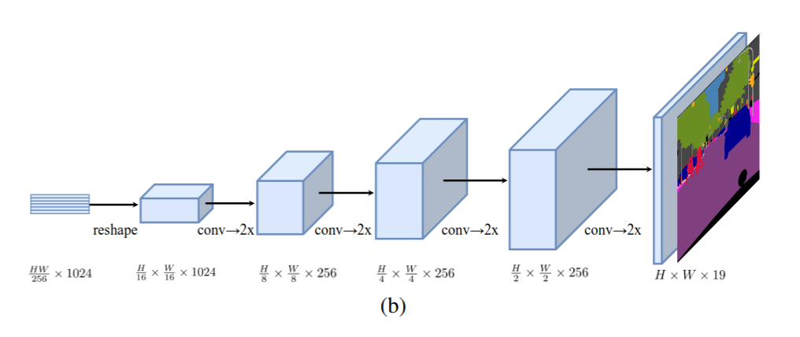
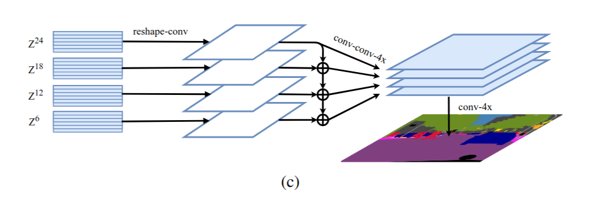

  

<h1 align="center"> SETR </h1>

> SETR: [Rethinking Semantic Segmentation from a Sequence-to-Sequence Perspective with Transformers — Zheng et al., CVPR 2021](https://openaccess.thecvf.com/content/CVPR2021/papers/Zheng_Rethinking_Semantic_Segmentation_From_a_Sequence-to-Sequence_Perspective_With_Transformers_CVPR_2021_paper.pdf)

# Background
After transformer seen as a game changer in the field many researchers attemped to borrow it from NLP area to different doamins like computer vision, this paper is one of them. the computer vision area and semantic segmentation problem was dominated with fully convoulational networks (FCN), the first attemps worked on replacing CNNs with transformer.
it is striking how first attemps used Transformer architecture as a black box (it will be illustared more later)

# Architecture
The classical encoder-decoder structure continued but replaced the CVV encoder with a pure transformer
## Encoder (ViT)
the first paper used transformer on images was Vit (Vision Transformer), SETR borrowed the same idea without any modification
**Encoding Process**
1. Split the image into 16 crops.
2. Project each crop to 1D array to match classical Transformer input shape.
3. Build the sequence with crops (each crop as word)
4. Feed the full sequence of tokens to standa

## Decoder
the paper introduced 3 types of decoders
### 1. Naive decoder
  a simple 2 layers network then output is upsampled to the full image resolution followed by a classification layer with pixel wise cross entropy loss
### 2. Progressive Upsampling (PUP) decoder

  PUP applies multi layer netword each one is responsable to upscale the output with 2X. this give the model a chance to refine features at each scale which prevent introduced noisy predictions.
  
### 3. Multi-Level Aggregation (MLA) decoder 

  Similar to feature pyramid network, MLA takes the output of some intermadiate layers of encoder and independently projected and upsampled to 1/4 of original image resolution then all of them are concatenated and fused. 

## Notes: 
> 1. even with image as a 2D array instead of fixing the transformer so it can deal with 2D array, they projected image to 1D array 
> 2. Transformer was used as a blackbox
