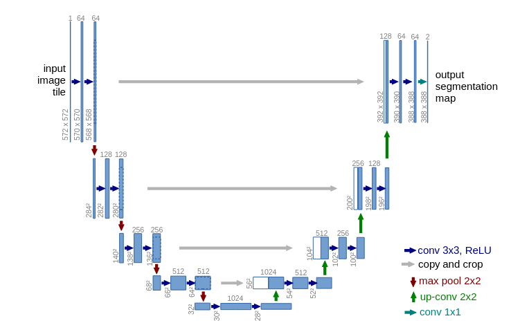

  

<h1 align="center"> U-NET </h1> 

> Convolutional Networks for Biomedical Image Segmentation — Ronneberger et al., 2015

## Background
Around 2015, deep learning had established itself as a solid and fruitful path in research. many ideas were borrowed from classical ML and transferred to DL framework.
In the paper authors express clearly what is solid truth these days which is importance of large training datasets and depth of the network.

U-Net was a pioneering paper going from classical ML algorithms (sliding window, super-pixel and Discrete Energy minimzation) to DL world

# Architecture
| Block | Channels(3 for input image) | Resolution (512^2 for input image) |
|---|---|---|
| enc_block1 | 64 | 256 |
| enc_block2 | 128 | 128 |
| enc_block3 | 256 | 64 |
| enc_block4 | 512 | 32 |
| bottleneck | 1024 | 16 |
| dec_block4 | 512 | 32 |
| dec_block3 | 256 | 64 |
| dec_block2 | 128 | 128 |
| dec_block1 | 64 | 256 |
| output | 21 | 512 |

It is a simple Encoder-Decoder style 

**Encoder**: a stack of 3x3 convolutions (unpadded convolutions), each followed by a rectified linear unit (ReLU) and a 2x2 max pooling operation with stride 2 for downsampling.

**Decoder**: upsampling of the feature map followed by a 2x2 convolution (“up-convolution”) that halves the number of feature channels, a concatenation with the correspondingly cropped feature map from the contracting path, and two 3x3 convolutions, each followed by a ReLU. 

## Key Idea
Vanilla CNNs for segmenation lose spatial information through downsampling and the paper's key contribution is the `skip connection` from encoder layers to corresponding decoder layers (the skip connection was first introduced in ``ResNet:Deep Residual Learning``)

# Resnet50 in place of Encoder
a solid belief these days is whenever u can use a pretrained model, so I used Resnet50 in place of Encoder part. 
you can find implementation in ``res_unet_model.py``.

## Architecture
| Block | Source | Channels | Resolution (512 input) |
|---|---|---|---|
| enc_block0 | ResNet50 stem + maxpool | 64 | 128 |
| enc_block1 | ResNet50 layer1 | 256 | 128 |
| enc_block2 | ResNet50 layer2 | 512 | 64 |
| enc_block3 | ResNet50 layer3 | 1024 | 32 |
| enc_block4 | ResNet50 layer4 | 2048 | 16 |
| bottleneck | Custom | 4096 → 2048 | 8 → 16 |
| dec_block4 | Custom | 2048 → 1024 | 32 |
| dec_block3 | Custom | 1024 → 512 | 64 |
| dec_block2 | Custom | 512 → 256 | 128 |
| dec_block1 | Custom | 256 → 128 | 256 |
| dec_block0 | Custom | 128 → 21 | 512 |
